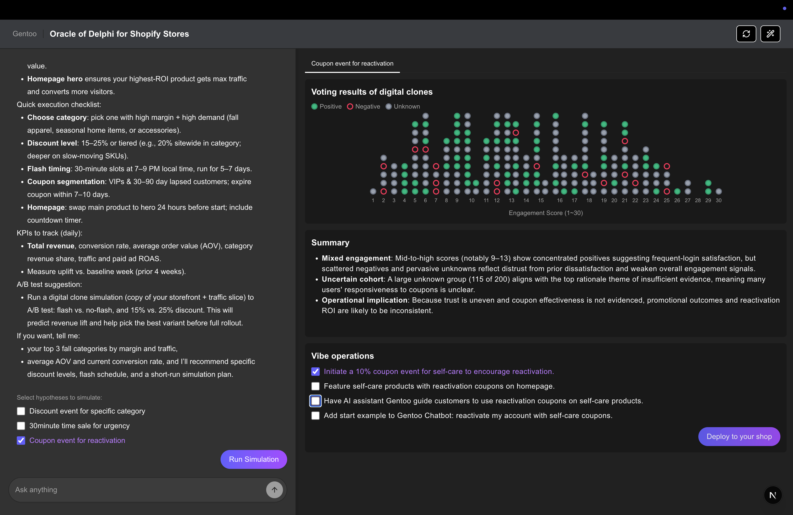
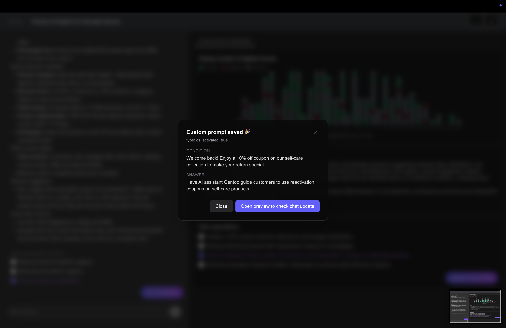
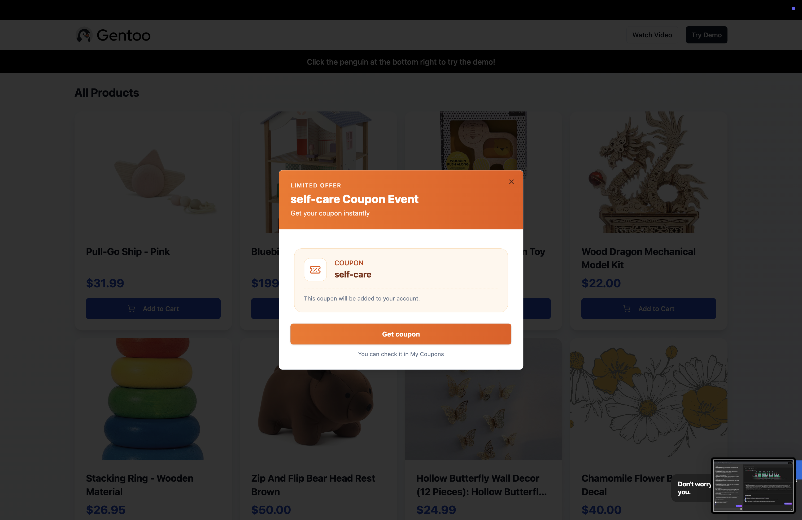
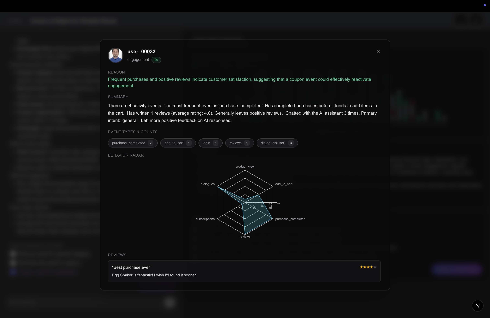
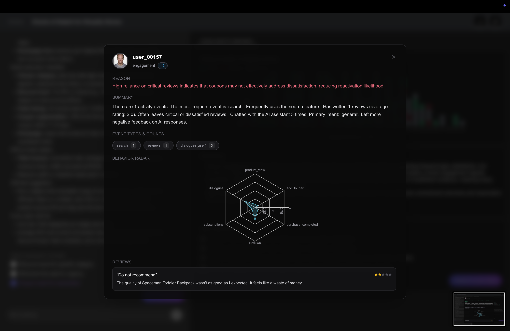
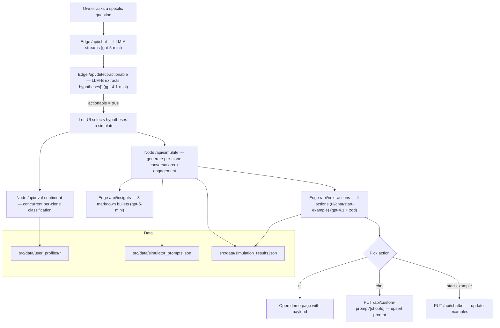

## Gentoo GPT‑5 — Oracle of Delphi for Shopify Stores

▶️ Watch YouTube demo highlights https://youtu.be/GlMtra0T-ls

Pragmatic “Oracle of Delphi” for Shopify stores: ask a question, it simulates with digital customer clones, then proposes deployable next actions.

Ask about product, pricing, or promo hypotheses. The left panel is a live chat with the owner (LLM‑A). The right panel simulates n digital customer clones chatting with a store agent and records purchase decisions and reasons—then turns them into charts and actions.

### Screenshots

#### 1) Ask & Detect
- Conversation → action detection → coupon action proposal



#### 2) Customize Action
- Edit/execute with a custom prompt



#### 3) Deploy & Reflect
- Coupon action reflected on demo page



#### 4) Results & Personas
- Simulation done / aggregation view

  Legend: green dot = positive, red dot = negative, gray dot = unknown (per‑clone decision/label)


- Digital clone profiles (positive / negative examples)





### What it does

- Auto‑detects when a simulation is needed from the owner’s question (LLM‑B)
- Runs multi‑turn chats for sampled clones from CSV/JSON profiles (1–4 turns)
- Records purchase decision and reason per clone, then shows cohort‑level charts
- Left chat streams with `useChat`
- “Next Action” execution: e.g., coupon actions or custom prompt flows

### How it works

1. Owner asks a question on the left; LLM‑A streams an answer
2. LLM‑B decides whether a simulation is warranted and triggers it
3. Simulator samples clone profiles and runs multi‑turn agent conversations
4. It stores decision/reason/logs and aggregates results
5. The right panel visualizes outcomes and reflects actions

### Service flow



## Quickstart

### Requirements

- Node.js 20+
- npm (repo includes `package-lock.json`)

### Install and run

```bash
npm install

# local dev
npm run dev

# production build/run
npm run build && npm start
```

### Environment variables (.env.local)

```bash
# OpenAI (Vercel AI SDK — @ai-sdk/openai)
OPENAI_API_KEY=sk-...

# Base URLs
NEXT_PUBLIC_BASE_URL=http://localhost:3000
NEXT_PUBLIC_BASE_URL_PROD=https://your-prod.example.com

# External integration IDs
NEXT_PUBLIC_ALDEA_SHOP_ID=your-shop-id
NEXT_PUBLIC_ALDEA_PARTNER_ID=your-partner-id
NEXT_PUBLIC_ALDEA_CHATBOT_ID=your-chatbot-id
```

Used in `src/app/api/chatbot/route.ts`, `src/app/api/custom-prompt/[shopId]/route.ts`, and `src/components/panels/CenterSimulationPanel.tsx`.

## Project layout (excerpt)

```text
src/
  app/
    api/
      chat/route.ts                  # left chat streaming API
      detect-actionable/route.ts     # actionability detection
      simulate/route.ts              # run n-clone simulation
      next-actions/route.ts          # next action generation
      insights/route.ts              # insights & summaries
      eval-sentiment/route.ts        # sentiment / reaction eval
    page.tsx                         # entry
  components/
    panels/
      LeftChatPanel.tsx              # left LLM chat panel
      CenterSimulationPanel.tsx      # simulation, charts, controls
      RightHistoryPanel.tsx          # history, logs, results
    ui/                              # shadcn/ui components
  data/
    simulator_prompts.json           # simulator system prompts
    simulation_results.json          # sample results
    user_profiles/                   # ~200 sample clone profiles
public/
  screenshot/                        # screenshots used in README
  user_facepack/                     # avatar images
```

## API surface (summary)

- `GET/PUT /api/chatbot` — chatbot/partner linkage and state updates
- `GET/PUT /api/custom-prompt/[shopId]` — custom prompt CRUD/execute
- `POST /api/detect-actionable` — simulation/actionability detection
- `POST /api/simulate` — run digital clone multi‑turn simulation
- `POST /api/next-actions` — generate next actions (e.g., coupons)
- `POST /api/insights` — generate insights/summaries
- `POST /api/eval-sentiment` — evaluate sentiment/reaction
- `POST /api/chat` — left panel chat streaming

## Models & runtime

- Uses Vercel AI SDK with OpenAI models:
  - `gpt-5-mini` (chat, insights)
  - `gpt-4.1` / `gpt-4.1-mini` (actions, detection)
- Runs in Next.js App Router; chat endpoint uses Edge runtime where applicable.

## Stack

- Next.js (App Router) + TypeScript
- Vercel AI SDK: `@ai-sdk/openai`, `@ai-sdk/react`, `ai`
- UI: shadcn/ui, Tailwind CSS, Lucide, Recharts
- State/data: TanStack Query, Zustand

## License

[MIT](./LICENSE)

## Docs

- Product/tech notes: [PRD.md](./PRD.md)
- Next.js template notes: [NEXT-README.md](./NEXT-README.md)


